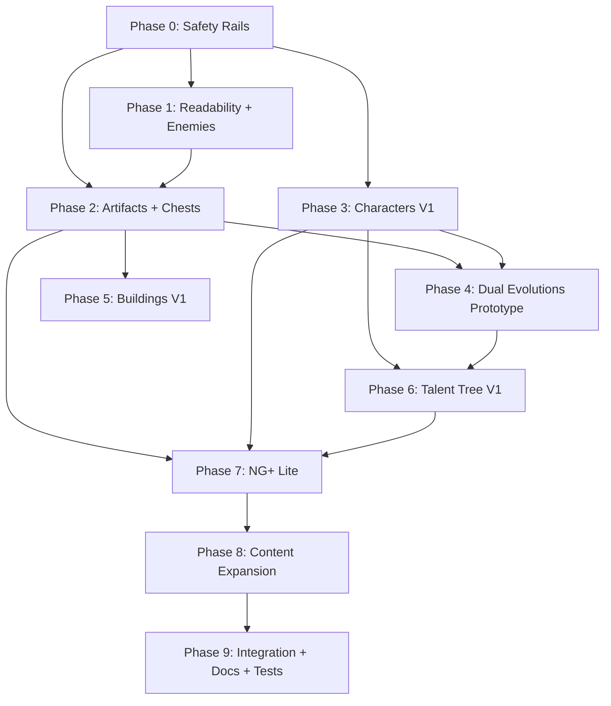

# REVISED Implementation Plan

This document is a revised implementation roadmap for the next major expansion of **Everlasting Oblivion - Limbo Trial**.

The original feature list is strong, but the scope has been reorganized into safer vertical slices. The goal is to add meaningful replayability without burying the project under several large, half-finished systems at once.

The main design priority is:

> Build fewer systems first, but make each one playable, visible, balanced, and easy to expand.

## Implementation Status

Completed in the first expansion milestone:

- [x] Phase 0: feature flags, central balance limits, shared stat modifier utilities, typed artifact special-effect handlers, and documented stacking rules
- [x] Phase 1: red enemy projectile language, capped hazards, and Plague Crawler, Ember Imp, and Grave Defiler wave integration
- [x] Phase 2: run-only artifacts, weighted no-duplicate rolls, tier unlocks, chest spawning, artifact application, and artifact HUD
- [x] Phase 3: Haunted, The Penitent, and Ashwalker; character selection; starter weapons; stat profiles; save migration; unlock tracking; and result notices
- [x] Stabilization pass: visible tracked reliquaries, labeled artifact tooltips, shake-safe HUD bounds, longer pre-evolution scaling, and a Bone Scythe uplift
- [x] Player-feedback pass: compact reliquary pulses, visible shields, timed-buff bars, and explicit powerup pickup explanations
- [x] Reliquary presentation pass: dedicated themed chest asset and non-modal walk-in soul-lock loot ritual
- [x] Character-animation experiment: remove reliquary circle and validate a high-definition four-direction, three-pose Haunted walk sheet
- [x] Character-animation correction: replace near-static limb poses with exaggerated contact and raised-knee passing silhouettes
- [x] Character-animation quality fallback: reject repeated-pose walk cycles and use stable directional spectral hover frames until a properly authored animation exists
- [x] Combat-feedback cleanup: full-distance red elite charges, full-range Bloodletter throws, compact unboxed reliquary tracking, and no floating reliquary label
- [x] Existing-weapon identity pass part 1: distinct first cadence targets for Soul Bolt, Hellfire Sigil, Grave Lance, and Dirge Staff
- [x] Existing-weapon identity pass part 2: distinct cadence targets for Bone Scythe, Wailing Shards, Cinder Reliquary, and Ashen Longbow
- [x] Focused upgrade-family foundation: one-stack cadence tradeoffs, state-boundary stack enforcement, and an F9 Weapon Identity Lab
- [x] Authored upgrade-effects foundation: projectile splintering, spreading area blasts, delayed echoes, Forbidden Tutelage, and an F10 Upgrade Effects Lab
- [x] Bloodletter capstone correction: Headsman's Procession multi-throws and a stronger three-to-five-axe Crimson Orbit with wider bounded coverage
- [x] Late-run specialization pass: remaining focused weapon upgrades return after evolution, stay bounded by max stacks, and no longer imply invalid level-eight progression
- [x] Public web shell: thematic Tailwind landing page, lazy browser-game launch, Supabase damage/kill leaderboard, and bounded Netlify Function submissions
- [x] Curse and Echo foundation: run-level curse tiers, cursed reward mutation, curse-gated spawn pressure, Warden curse hooks, and the first saved Death Echo return
- [x] Curse pressure polish: visible curse escalation, recurring curse surges, curse-specific enemy stat pressure, cursed enemy tinting, and first Cinder Reliquary containment tuning
- [x] Live playtest data: private Supabase run analytics, named end-screen upload, and public leaderboard rows for real standard runs

The first completed standard run proved that the baseline is survivable. Active-run timing, bounded adaptive threat, the Warden rebuild, Crimson Orbit, the existing-weapon identity pass, the first conditional upgrades, and visible curse pressure are now implemented. The immediate focus is a short balance/telemetry pass using uploaded Supabase run data before adding the first new weapon from `docs/NEXT_COMBAT_EXPANSION.md`. Dual evolutions, buildings, talents, and NG+ remain intentionally delayed until that combat foundation is stable.

Following the first completed standard run, the active combat-expansion direction is recorded in `docs/NEXT_COMBAT_EXPANSION.md`. It supersedes the earlier assumption that progression should be slowed: fast progression remains intentional, while stronger upgrade choices, repeated Warden and cadence playtests, and five additional weapons become the active priorities.

---

# High-Level Goals

This expansion should improve the game in five major ways:

1. **Improve combat readability**

   * Enemy attacks must be visually distinct from player attacks.
   * Hazards and telegraphs must be clear and fair.

2. **Increase run variety**

   * Add artifacts, chests, new enemies, and arena modifiers.

3. **Add replayable identity**

   * Add playable characters with different stat profiles and starter weapons.

4. **Improve long-term progression**

   * Replace or evolve the flat meta-upgrade system into a smaller first version of a branching talent tree.

5. **Prepare for endgame replay**

   * Add a first version of New Game+ without overbuilding the full variant/loot-table system too early.

---

# Locked Design Decisions

| Area              | Decision                                                |
| ----------------- | ------------------------------------------------------- |
| Arena count       | One arena now, architecture supports more later         |
| Lore depth        | Flavor text per character, no deep narrative system yet |
| NG+               | Yes, but start with NG+ Lite before full variants       |
| Buildings         | Per-run arena modifiers, but start with simple effects  |
| Character unlocks | Challenges + milestones, some hidden unlocks later      |
| Artifacts         | Run-only passive items, unlocked in batches over time   |
| Dual evolutions   | Yes, but prototype on 3 weapons before all weapons      |
| Talent tree       | Yes, but start smaller than the full 35–50 node version |
| Scope style       | Vertical slices before massive content expansion        |

---

# Core Implementation Rules

## 1. Use Feature Flags

Add a simple feature flag configuration before implementing the large systems.

Suggested file:

```ts
// src/game/config/featureFlags.ts

export const FEATURE_FLAGS = {
  enemyReadabilityPass: true,
  newEnemies: true,
  artifacts: true,
  chests: true,
  characters: true,
  dualEvolutions: false,
  buildings: false,
  talentTree: false,
  newGamePlus: false,
} as const;
```

Purpose:

* New systems can be disabled if unstable.
* Agent work becomes safer.
* Partially implemented systems do not need to break the main game loop.
* Future debugging becomes easier.

---

## 2. Add a Central Balance Config

Before artifacts, buildings, talents, characters, and NG+ all begin modifying stats, create a shared balance config.

Suggested file:

```ts
// src/game/config/balanceConfig.ts

export const BALANCE = {
  maxMoveSpeedMultiplier: 2.0,
  maxCooldownReduction: 0.6,
  maxPickupRadiusMultiplier: 3.0,
  maxCritChance: 0.75,
  maxAreaMultiplier: 2.5,
  maxAttackSpeedMultiplier: 2.5,

  baseLegendaryArtifactChance: 0.05,
  baseRareArtifactChance: 0.15,

  maxActiveChests: 2,
  maxActiveHazards: 30,
  maxActiveBuildings: 2,
} as const;
```

Purpose:

* Prevent hidden balance values from spreading across the codebase.
* Make tuning easier.
* Prevent artifacts, talents, and characters from stacking into uncontrolled power creep.

---

## 3. Define Stat Stacking Order

All systems must follow the same stat calculation order.

Recommended order:

1. Base player stats
2. Character stat overrides
3. Talent tree modifiers
4. Run artifacts
5. Temporary buffs/debuffs
6. Building effects
7. Difficulty modifiers

Document whether each category stacks additively or multiplicatively.

Recommended default:

* Small stat bonuses: additive within their category
* Major multipliers: multiplicative between categories
* Hard caps applied at the end

Example:

```ts
finalMoveSpeed = clamp(
  baseMoveSpeed
    * characterMoveSpeedMultiplier
    * talentMoveSpeedMultiplier
    * artifactMoveSpeedMultiplier
    * temporaryMoveSpeedMultiplier,
  minMoveSpeed,
  maxMoveSpeed
);
```

---

## 4. Use Content Registries

All new content should be data-driven.

Recommended registries:

```ts
ARTIFACTS
WEAPONS
CHARACTERS
BUILDINGS
DIFFICULTIES
TALENT_TREE
ENEMIES
UPGRADES
```

Systems should query these registries instead of hardcoding content IDs in multiple places.

---

## 5. Use Typed Special Effect Handlers

Avoid loose strings like this without validation:

```ts
special: 'death-reprieve'
```

Instead, add a handler registry.

Example:

```ts
export type SpecialEffectId =
  | 'death-reprieve'
  | 'start-with-curse'
  | 'all-weapons-pierce'
  | 'extra-upgrade-choice'
  | 'soul-gain-on-dash';

export const SPECIAL_EFFECT_HANDLERS: Record<SpecialEffectId, SpecialEffectHandler> = {
  'death-reprieve': handleDeathReprieve,
  'start-with-curse': handleStartWithCurse,
  'all-weapons-pierce': handleAllWeaponsPierce,
  'extra-upgrade-choice': handleExtraUpgradeChoice,
  'soul-gain-on-dash': handleSoulGainOnDash,
};
```

Rule:

> No artifact, talent, character, or building may declare a special effect unless the handler exists.

This prevents tooltip promises that do nothing in gameplay.

---

# Phase 0: Safety Rails and Architecture Prep

**Goal:** Prepare the codebase for several new content systems before adding the actual content.

**Estimated scope:** Small but important.

## 0A: Add Feature Flags

### New file

`src/game/config/featureFlags.ts`

Add flags for:

* new enemy types
* artifacts
* chests
* characters
* dual evolutions
* buildings
* talent tree
* NG+

## 0B: Add Balance Config

### New file

`src/game/config/balanceConfig.ts`

Add shared caps and tuning values:

* max move speed
* max cooldown reduction
* max pickup radius
* max crit chance
* max active hazards
* max active chests
* artifact rarity weights
* building limits

## 0C: Add Shared Modifier Utilities

### New or modified file

`src/game/utils/statModifiers.ts`

Create helpers for applying and clamping stat modifiers.

Recommended helpers:

```ts
applyStatModifiers()
applyWeaponModifiers()
clampPlayerStats()
calculateFinalPlayerStats()
```

## 0D: Document Stacking Rules

### Modify

`docs/ARCHITECTURE.md`

Add a section:

```md
## Stat Modifier Stacking Order
```

Include:

1. character stats
2. talents
3. artifacts
4. temporary buffs
5. buildings
6. difficulty

---

# Phase 1: Combat Readability and Enemy Variety

**Goal:** Make combat clearer and add early/mid-game enemy variety.

This phase should remain close to the original plan. It is low-risk and high-impact.

---

## 1A: Red Enemy Projectiles

**Goal:** Enemy projectiles must be instantly distinguishable from player attacks.

### Modify

`src/game/constants.ts`

Add:

```ts
enemyProjectile: 0xd94545
enemyProjectileGlow: 0xff6a4d
enemyTelegraph: 0xff3b30
```

### Modify

`src/game/systems/EnemyAbilitySystem.ts`

Update enemy projectile visuals:

* void orbs use red/crimson tint
* grave arrows use red/orange tint
* enemy projectile glow is warm-colored
* Warden attacks remain visually distinct but consistent with enemy danger colors

Player attacks should remain pale blue, purple, white, or other non-red colors.

---

## 1B: Add Telegraph Standards

Create a simple visual language:

| Type                 | Color / Style                                      |
| -------------------- | -------------------------------------------------- |
| Player attacks       | Blue, pale purple, white                           |
| Enemy projectiles    | Red / crimson                                      |
| Enemy explosions     | Red/orange circle                                  |
| Enemy ground hazards | Red, green, sickly purple, but with red danger rim |
| Safe pickups         | Gold, blue, green                                  |
| Interactive objects  | White/gold outline                                 |

Document this in `docs/DESIGN.md`.

---

## 1C: New Enemy Types V1

Add 2–3 new enemies.

### Modify

`src/game/types/gameTypes.ts`

Add enemy IDs:

```ts
'plague-crawler'
'ember-imp'
'grave-defiler'
```

Add enemy behaviors:

```ts
'trail-hazard'
'bomb-thrower'
```

Add enemy ability IDs:

```ts
'plague-trail'
'fire-flask'
```

---

## 1D: Enemy Definitions

### Modify

`src/game/data/enemies.ts`

Add:

| Enemy          | Behavior     | Role                          | Spawn Timing |
| -------------- | ------------ | ----------------------------- | ------------ |
| Plague Crawler | trail-hazard | leaves damaging ground pools  | 2:00+        |
| Ember Imp      | bomb-thrower | throws telegraphed fire flask | 4:00+        |
| Grave Defiler  | trail-hazard | tougher hazard enemy          | 7:00+        |

---

## 1E: Enemy Ability Implementations

### Modify

`src/game/systems/EnemyAbilitySystem.ts`

Add `trail-hazard`:

* enemy periodically drops a damaging ground zone
* zone fades after duration
* player takes damage when overlapping
* obeys player iframe rules
* respects `BALANCE.maxActiveHazards`

Add `bomb-thrower`:

* enemy chooses a position near the player
* shows a red telegraph circle for around 1.2 seconds
* explosion triggers after telegraph
* explosion deals area damage
* explosion should be dodgeable and readable

---

## 1F: Wave Integration

### Modify

`src/game/data/waves.ts`

Add:

* Plague Crawler to early-mid pools
* Ember Imp to caster-like pools starting around 4 minutes
* Grave Defiler as a late-mid hazard enemy

Do not overload the player too early. Hazard enemies should be introduced gradually.

---

## 1G: Preload Assets

### Modify

`src/game/scenes/PreloadScene.ts`

Add preload entries for:

* plague crawler
* ember imp
* grave defiler
* ground hazard
* fire flask
* telegraph circle

Temporary placeholder art is acceptable as long as it is visually distinct.

---

# Phase 2: Artifacts and Chests Vertical Slice

**Goal:** Add the first major run-variety system.

Artifacts should be run-only passive items. Chests spawn during runs and reward artifacts.

Start smaller than the original plan.

Initial scope:

* 12–15 artifacts
* 1 chest type
* 1 artifact bar UI
* base artifact pool only
* optional tier-2 unlock if time allows

---

## 2A: Artifact Type Foundation

### Modify

`src/game/types/gameTypes.ts`

Add:

```ts
export type ArtifactId = string;

export type ArtifactRarity =
  | 'common'
  | 'uncommon'
  | 'rare'
  | 'legendary';

export type ArtifactPoolTier =
  | 'base'
  | 'tier-2'
  | 'ng-plus';

export interface ArtifactDefinition {
  id: ArtifactId;
  name: string;
  description: string;
  rarity: ArtifactRarity;
  poolTier: ArtifactPoolTier;
  iconTexture: string;
  modifiers?: StatModifier[];
  weaponModifiers?: WeaponModifier[];
  special?: SpecialEffectId;
}
```

Add to `RunState`:

```ts
artifacts: ArtifactId[];
```

Add to `SaveData`:

```ts
unlockedArtifactTiers: ArtifactPoolTier[];
```

Default save should include:

```ts
unlockedArtifactTiers: ['base']
```

---

## 2B: Artifact Data

### New file

`src/game/data/artifacts.ts`

Start with 12–15 artifacts.

Suggested first pool:

## Common

| Artifact          | Effect              |
| ----------------- | ------------------- |
| Tarnished Compass | +10% pickup radius  |
| Pilgrim's Boots   | +8% movement speed  |
| Bone Charm        | +5 max HP           |
| Cracked Hourglass | -5% weapon cooldown |
| Grave Dust        | +5% soul gain       |

## Uncommon

| Artifact          | Effect                                        |
| ----------------- | --------------------------------------------- |
| Mourner's Thread  | +12% crit damage                              |
| Hollow Lantern    | +15% area                                     |
| Blood-Warmed Coin | souls on dash cooldown completion or dash use |
| Ashen Ring        | +8% damage while below 50% HP                 |

## Rare

| Artifact        | Effect                             |
| --------------- | ---------------------------------- |
| Saintless Vein  | small lifesteal                    |
| Warden's Brand  | +15% boss damage                   |
| Black Reliquary | one weapon gains pierce            |
| Death's Receipt | cooldown reduction on kill, capped |

## Legendary

| Artifact     | Effect                                      |
| ------------ | ------------------------------------------- |
| Sixth Sin    | +1 weapon slot                              |
| Funeral Star | all weapons gain small pierce or area bonus |

Avoid too many complex special effects in the first version.

---

## 2C: Artifact Roll Logic

### New file or inside

`src/game/data/artifacts.ts`

Add:

```ts
getAvailableArtifacts(save: SaveData, difficulty: DifficultyTier): ArtifactDefinition[]
rollArtifact(available: ArtifactDefinition[], owned: ArtifactId[]): ArtifactDefinition | null
```

Rules:

* filter by unlocked artifact tier
* filter by difficulty
* no duplicate artifacts in the same run
* weighted random by rarity
* return `null` if no valid artifact remains

Suggested base weights:

| Rarity    | Weight |
| --------- | ------ |
| Common    | 50     |
| Uncommon  | 30     |
| Rare      | 15     |
| Legendary | 5      |

---

## 2D: Chest System

### New file

`src/game/systems/ChestSystem.ts`

Responsibilities:

* spawn chests during the run
* track active chests
* despawn old chests
* detect player interaction
* roll artifact reward
* show reward popup
* notify HUD

Initial rules:

* first chest spawns after 25–35 seconds; later chests spawn every 65–85 seconds
* max 2 active chests
* despawn after 60 seconds
* player opens by walking over it
* chest spawns within a reachable 280–480 unit ring around the player
* chest should not spawn outside valid arena bounds
* show a world label plus a direction, distance, and lifetime tracker

---

## 2E: Artifact Application

### Modify

`src/game/systems/RunState.ts`

Add:

```ts
applyArtifact(def: ArtifactDefinition): void
hasArtifact(id: ArtifactId): boolean
```

Rules:

* apply stat modifiers through shared modifier utilities
* apply weapon modifiers safely
* register special effects through typed handler system
* update artifact list

---

## 2F: Artifact UI

### New file

`src/game/ui/ArtifactBar.ts`

Features:

* horizontal row of artifact icons
* small icon size
* rarity border
* hover tooltip
* artifact name
* rarity
* description
* simple pop animation when acquired

### Modify

`src/game/ui/HudSystem.ts`

Integrate `ArtifactBar`.

### Modify

`src/game/scenes/GameScene.ts`

Wire:

```ts
ChestSystem -> roll artifact -> RunState.applyArtifact -> HudSystem.updateArtifacts
```

---

## 2G: Save Migration

### Modify

`src/game/systems/SaveSystem.ts`

Add migration for:

```ts
unlockedArtifactTiers
```

Default:

```ts
['base']
```

Optional:

Add `checkArtifactUnlocks(save)` but keep only one simple unlock for now.

Example:

```ts
tier-2 unlocks after 500 total kills
```

---

# Phase 3: Playable Characters V1

**Goal:** Add replay identity earlier than the full talent tree.

Characters are easier for players to understand than a large passive talent tree. They also make the game more marketable and replayable.

Start with 3 characters.

---

## 3A: Character Data Model

### Modify

`src/game/types/gameTypes.ts`

Add:

```ts
export type CharacterId =
  | 'haunted'
  | 'the-penitent'
  | 'ashwalker';

export interface CharacterDefinition {
  id: CharacterId;
  name: string;
  title: string;
  flavorText: string;
  texture: string;
  starterWeapon: WeaponId;
  baseStatOverrides: Partial<PlayerStats>;
  unlockCondition: CharacterUnlockCondition;
}

export interface CharacterUnlockCondition {
  type: 'default' | 'challenge' | 'milestone' | 'hidden';
  description: string;
}
```

Save data additions:

```ts
selectedCharacter?: CharacterId;
unlockedCharacters: CharacterId[];
characterStats: Record<CharacterId, CharacterRunStats>;
```

---

## 3B: Character Data

### New file

`src/game/data/characters.ts`

Initial characters:

| Character    | Role              | Starter Weapon                  | Stats                                  | Unlock                              |
| ------------ | ----------------- | ------------------------------- | -------------------------------------- | ----------------------------------- |
| Haunted      | Balanced default  | Bone Scythe                     | current defaults                       | unlocked                            |
| The Penitent | Tank / slow       | Tombstone Hammer or Bone Scythe | +40 HP, -15% speed, +10% damage        | survive 10 minutes in 3 runs        |
| Ashwalker    | Fast glass cannon | Soul Bolt                       | -25 HP, +25% speed, +15% pickup radius | defeat Warden or survive 15 minutes |

If Tombstone Hammer is not implemented yet, use Bone Scythe for Penitent temporarily.

---

## 3C: Character Select Scene

### New file

`src/game/scenes/CharacterSelectScene.ts`

Features:

* character grid or carousel
* portrait
* name
* title
* flavor text
* starter weapon
* stat differences
* locked state
* unlock requirement text
* selected character stored before run starts

### Modify

`src/game/scenes/MainMenuScene.ts`

Change:

```ts
Begin Trial -> CharacterSelectScene -> GameScene
```

Instead of:

```ts
Begin Trial -> GameScene
```

---

## 3D: RunState Character Integration

### Modify

`src/game/systems/RunState.ts`

Constructor should accept:

```ts
saveData
characterId
```

Apply:

1. base player stats
2. character stat overrides
3. talent/meta modifiers
4. artifacts during run

Starter weapon should come from character definition instead of being hardcoded.

---

## 3E: Character Unlocks

### Modify

`src/game/systems/SaveSystem.ts`

Add:

```ts
checkCharacterUnlocks(save): CharacterId[]
```

Track:

* runs played per character
* best survival time
* Warden kills
* deaths
* total kills
* total souls earned

### Modify

End scenes:

`src/game/scenes/EndScenes.ts`

Show character unlock notification after run summary.

---

## 3F: Delay Character-Exclusive Weapons

Do not implement character-exclusive weapons yet.

Reason:

* starter weapons and stat overrides are enough for v1
* exclusive weapon filtering adds complexity to upgrade pools
* exclusive weapons can be added after dual evolution and weapon pool logic is stable

---

# Phase 4: Dual Weapon Evolutions Prototype

**Goal:** Validate the dual evolution system before applying it to every weapon.

Do not implement dual evolutions for all weapons immediately.

Start with:

1. Bone Scythe
2. Soul Bolt
3. Bloodletter Axe

These cover:

* melee arc weapon
* projectile weapon
* returning/orbiting weapon

---

## 4A: Dual Evolution Data Model

### Modify

`src/game/types/gameTypes.ts`

Add:

```ts
export type EvolutionPath = 'a' | 'b';

export interface WeaponEvolution {
  path: EvolutionPath;
  name: string;
  description: string;
}

export interface WeaponRuntimeState {
  // existing fields...
  evolutionPath?: EvolutionPath;
}
```

Modify weapon definitions to support:

```ts
evolutionA: WeaponEvolution;
evolutionB?: WeaponEvolution;
```

Do not keep ambiguous `evolution` naming long-term. Prefer explicit `evolutionA` and `evolutionB`.

---

## 4B: Prototype Evolution Choices

### Modify

`src/game/data/weapons.ts`

Add Path B for the first three weapons.

| Weapon          | Path A                                              | Path B                                                                                    |
| --------------- | --------------------------------------------------- | ----------------------------------------------------------------------------------------- |
| Bone Scythe     | Ossuary Reaper — stronger/double sweep              | Harvest Moon — sweep slows enemies                                                        |
| Soul Bolt       | Choir of the Damned — chain lightning/soul chaining | Soulfire Barrage — fires multiple bolts in a spread, tuned to feel meaningfully different |
| Bloodletter Axe | Twice-Bled — return damage                          | Crimson Orbit — axe orbits the player instead of returning                                |

Important design rule:

> Path B must change how the weapon behaves, not just increase numbers.

---

## 4C: Upgrade Offer Rework

### Modify

`src/game/systems/UpgradeOfferSystem.ts`

When a weapon reaches evolution readiness:

* offer exactly 2 choices
* one for Path A
* one for Path B
* use a special offer kind:

```ts
offerKind: 'evolution'
```

Do not mix evolution choices into normal 3-choice upgrade offers.

---

## 4D: Upgrade Data

### Modify

`src/game/data/upgrades.ts`

Add:

```ts
evolve-bone-scythe-a
evolve-bone-scythe-b
evolve-soul-bolt-a
evolve-soul-bolt-b
evolve-bloodletter-axe-a
evolve-bloodletter-axe-b
```

---

## 4E: Evolution Execution

### Modify

`src/game/systems/WeaponEvolutionSystem.ts`

Check:

```ts
weaponState.evolutionPath
```

Execute the correct behavior.

### Modify

`src/game/systems/WeaponSystem.ts`

Add required behavior support for:

* slow on Bone Scythe hits
* multi-shot spread for Soul Bolt
* orbiting Bloodletter Axe

---

## 4F: Delay Full Weapon Expansion

Do not yet add all 9 dual evolutions.

Do not yet add all new weapons.

After this phase is playable, evaluate:

* Are dual evolutions understandable?
* Are the two choices meaningfully different?
* Does the UI clearly explain the choice?
* Does the code support adding more without becoming messy?

---

# Phase 5: Arena Buildings V1

**Goal:** Add per-run arena modifiers without overwhelming the player or destabilizing balance.

Buildings should make the arena feel different from run to run.

Start with:

* 3 buildings
* 1–2 buildings per run
* simple effects
* obvious visuals
* clear run-start notice

---

## 5A: Building Data Model

### Modify

`src/game/types/gameTypes.ts`

Add:

```ts
export type BuildingId =
  | 'soul-beacon'
  | 'crucible'
  | 'whispering-shrine'
  | 'blight-furnace';

export interface BuildingDefinition {
  id: BuildingId;
  name: string;
  description: string;
  texture: string;
  effectRadius: number;
  effectType: 'proximity' | 'aura' | 'interactive';
  special: BuildingEffectId;
}
```

---

## 5B: Building Data

### New file

`src/game/data/buildings.ts`

Initial buildings:

| Building          | Type        | Safer First Effect                                                 |
| ----------------- | ----------- | ------------------------------------------------------------------ |
| Soul Beacon       | Aura        | +25% soul value, +10% enemy spawn rate                             |
| Crucible of Agony | Proximity   | enemies near it drop extra XP/souls, but deal slightly more damage |
| Whispering Shrine | Interactive | one-use reward/curse choice                                        |
| Blight Furnace    | Aura        | occasional clearly telegraphed hazard patches                      |

Delay:

* Warden Obelisk
* enemy clone effects
* heavy spawn multipliers
* boss timing changes
* 2–4 buildings per run

---

## 5C: Building System

### New file

`src/game/systems/BuildingSystem.ts`

Responsibilities:

* choose 1–2 buildings at run start
* place them at valid positions
* avoid player spawn area
* avoid overlap with other important objects
* render sprites
* show name when player is nearby
* apply aura/proximity/interactive effects
* expose modifiers to other systems

---

## 5D: Run Start Notice

At the beginning of a run, show:

```txt
This trial contains:
- Soul Beacon
- Blight Furnace
```

This helps the player understand why the run feels different.

---

## 5E: System Integration

### Modify

`src/game/scenes/GameScene.ts`

Create `BuildingSystem` after arena creation.

Update it each frame.

Pass building modifiers to:

* EnemySystem
* PickupSystem
* ChestSystem
* RunState if needed

### Modify

`src/game/systems/EnemySystem.ts`

Allow spawn-rate and proximity modifiers.

### Modify

`src/game/systems/PickupSystem.ts`

Allow soul-value modifiers.

---

# Phase 6: Talent Tree V1

**Goal:** Replace or evolve the flat meta progression system with a smaller first version of a branching tree.

Do not start with 35–50 nodes.

Start with:

* 3 branches
* 6–8 nodes per branch
* 18–24 total nodes
* simple visual layout
* refund all
* save migration

---

## 6A: Talent Data Model

### Modify

`src/game/types/gameTypes.ts`

Add:

```ts
export type TalentNodeId = string;

export type TalentBranchId =
  | 'might'
  | 'souls'
  | 'fortune';

export type TalentNodeTier =
  | 'minor'
  | 'notable'
  | 'keystone';

export interface TalentNodeDefinition {
  id: TalentNodeId;
  branch: TalentBranchId;
  tier: TalentNodeTier;
  name: string;
  description: string;
  maxPoints: number;
  costPerPoint: number;
  prerequisites: TalentNodeId[];
  branchPointsRequired: number;
  modifiers?: StatModifier[];
  weaponModifiers?: WeaponModifier[];
  special?: SpecialEffectId;
  position: { x: number; y: number };
  connections: TalentNodeId[];
}
```

Save data:

```ts
talentPoints: Record<TalentNodeId, number>;
```

---

## 6B: Talent Data

### New file

`src/game/data/talentTree.ts`

Create 18–24 nodes.

## Path of Might

Theme: damage, crit, area.

Example nodes:

* +3% damage, multiple ranks
* +2% crit chance, multiple ranks
* +5% attack speed
* notable: +10% boss damage
* keystone: Executioner's Instinct

## Path of Souls

Theme: survival, mobility, recovery.

Example nodes:

* +8 max HP
* +5% movement speed
* -4% dash cooldown
* notable: +25% healing effectiveness
* keystone: Death's Reprieve

## Path of Fortune

Theme: souls, artifacts, choices.

Example nodes:

* +8% soul gain
* +10% pickup radius
* +5% rare artifact chance
* notable: +1 reroll
* keystone: Limbo's Gambit

---

## 6C: Talent Logic

### Modify

`src/game/systems/SaveSystem.ts`

Add:

```ts
canAllocateTalent(save, nodeId, tree)
allocateTalentPoint(save, nodeId, tree)
refundAllTalents(save, tree)
getTotalBranchPoints(save, branchId, tree)
```

Validation rules:

* enough souls
* prerequisites met
* max points not exceeded
* branch point requirement met
* node exists
* save migration completed

---

## 6D: Meta Progression Scene Rewrite

### Modify

`src/game/scenes/MetaProgressionScene.ts`

Rewrite into a simple first version.

Required:

* display three branches
* display nodes
* display connection lines
* show locked/available/allocated states
* click to allocate
* hover tooltip
* show soul cost
* show current souls
* refund all button
* back button

Delay:

* camera pan/zoom
* particles
* complex animations
* huge tree layout
* very large node count

---

## 6E: Talent Effects Integration

### Modify

`src/game/systems/RunState.ts`

On run start:

* read allocated talent nodes
* apply stat modifiers
* apply weapon modifiers
* register special effects

Special effects for v1:

| Effect               | Behavior                                              |
| -------------------- | ----------------------------------------------------- |
| death-reprieve       | survive one fatal hit at 1 HP with 2s invulnerability |
| extra-upgrade-choice | upgrade offers show 4 choices instead of 3            |
| start-with-curse     | start with random curse and gain soul bonus           |

Only implement special effects that have typed handlers.

---

# Phase 7: New Game+ Lite

**Goal:** Add endgame replay after first victory without building the full NG+ system immediately.

Start with:

* one NG+ tier
* difficulty multipliers
* enemy tint
* soul multiplier
* small artifact rarity bonus
* 3–5 NG+-exclusive artifacts

Delay:

* NG+2
* full enemy variant IDs
* unique enemy abilities
* full separate loot tables
* Warden phase acceleration

---

## 7A: Difficulty Data Model

### Modify

`src/game/types/gameTypes.ts`

Add:

```ts
export type DifficultyTier =
  | 'standard'
  | 'ng-plus';

export interface DifficultyDefinition {
  id: DifficultyTier;
  name: string;
  description: string;
  enemyHealthMultiplier: number;
  enemyDamageMultiplier: number;
  enemySpeedMultiplier: number;
  xpMultiplier: number;
  soulMultiplier: number;
  artifactRarityBonus: number;
}
```

Save data:

```ts
highestDifficultyUnlocked: DifficultyTier;
```

Default:

```ts
highestDifficultyUnlocked: 'standard'
```

---

## 7B: Difficulty Data

### New file

`src/game/data/difficulty.ts`

Add:

```ts
export const DIFFICULTIES: Record<DifficultyTier, DifficultyDefinition> = {
  standard: {
    id: 'standard',
    name: 'Limbo Trial',
    description: 'The standard trial.',
    enemyHealthMultiplier: 1,
    enemyDamageMultiplier: 1,
    enemySpeedMultiplier: 1,
    xpMultiplier: 1,
    soulMultiplier: 1,
    artifactRarityBonus: 0,
  },

  'ng-plus': {
    id: 'ng-plus',
    name: 'Limbo Awakened',
    description: 'A harsher version of Limbo with stronger enemies and better rewards.',
    enemyHealthMultiplier: 1.5,
    enemyDamageMultiplier: 1.35,
    enemySpeedMultiplier: 1.1,
    xpMultiplier: 1.2,
    soulMultiplier: 1.4,
    artifactRarityBonus: 0.05,
  },
};
```

---

## 7C: Difficulty Selection

### Modify

`src/game/scenes/CharacterSelectScene.ts`

After selecting character:

* if only standard unlocked, start standard run
* if NG+ unlocked, show difficulty choice
* locked NG+ shows requirement

Requirement:

```txt
Defeat the Warden once to unlock Limbo Awakened.
```

---

## 7D: Difficulty Integration

### Modify

`src/game/systems/RunState.ts`

Constructor accepts:

```ts
difficultyTier: DifficultyTier
```

### Modify

`src/game/systems/EnemySystem.ts`

Apply difficulty multipliers when spawning enemies.

In NG+:

* enemy HP × multiplier
* enemy damage × multiplier
* enemy speed × multiplier
* apply subtle red/ember tint to enemies

### Modify

`src/game/systems/PickupSystem.ts`

Apply soul multiplier.

### Modify

Artifact roll logic:

* add small rarity bonus in NG+
* include artifacts with `poolTier: 'ng-plus'`

---

## 7E: NG+ Artifacts

### Modify

`src/game/data/artifacts.ts`

Add 3–5 NG+ artifacts.

Examples:

| Artifact           | Effect                                                              |
| ------------------ | ------------------------------------------------------------------- |
| Warden's Eye       | show enemy health bars or boss damage bonus                         |
| Soul Furnace       | kills have small chance to explode                                  |
| Awakened Reliquary | +1 artifact choice when opening chest, if chest choices exist later |
| Red Moon Brand     | increased damage, but increased damage taken                        |
| Crown of the Lost  | stronger soul gain, reduced healing                                 |

Keep these powerful but risky.

---

## 7F: NG+ Unlock

### Modify

`src/game/systems/SaveSystem.ts`

After victory:

```ts
if defeatedWardenOnStandard:
  highestDifficultyUnlocked = 'ng-plus'
```

### Modify

End scenes:

Show unlock message:

```txt
New Difficulty Unlocked: Limbo Awakened
```

---

# Phase 8: Content Expansion Pass

**Goal:** Expand successful systems after the vertical slices are proven.

Only start this phase after Phases 1–7 are stable.

---

## 8A: More Artifacts

Expand from 12–15 to 25–30 artifacts.

Add:

* more rare artifacts
* more legendary artifacts
* build-defining artifacts
* artifact tier unlocks
* milestone-based artifact batches

Add artifact tiers:

```ts
'base'
'tier-2'
'tier-3'
'tier-4'
'ng-plus'
```

Possible unlocks:

| Tier    | Unlock            |
| ------- | ----------------- |
| base    | always            |
| tier-2  | 500 total kills   |
| tier-3  | 3 Warden defeats  |
| tier-4  | 10 Warden defeats |
| ng-plus | unlock NG+        |

---

## 8B: More Characters

Add:

| Character     | Role                        | Unlock |
| ------------- | --------------------------- | ------ |
| The Hollow    | risk/reward crit character  | hidden |
| Crimson Shade | sustain/lifesteal character | hidden |

Possible stats:

## The Hollow

* -20 HP
* +20% crit chance
* +30% crit damage
* unlock: die to Warden 10 times

## Crimson Shade

* +10% lifesteal
* -10% damage
* unlock: use blood shrine in 5 different runs

Now consider character-exclusive weapons.

Rules:

* character-exclusive weapons can appear only for that character
* other characters cannot roll them
* exclusive weapons should not be required for build viability

---

## 8C: More Dual Evolutions

After the prototype works, add Path B evolutions for all remaining weapons.

Suggested concepts:

| Weapon           | Path B                                                                 |
| ---------------- | ---------------------------------------------------------------------- |
| Hellfire Sigil   | Purgatory Gate — pulls enemies toward center before exploding          |
| Grave Lance      | Impaler's Verdict — lance sticks in enemies and deals damage over time |
| Wailing Shards   | Shattered Lament — fewer, larger shards that pierce                    |
| Cinder Reliquary | Ember Vortex — pulls pickups or enemies depending on balance           |
| Ashen Longbow    | Pincushion — repeated hits on same enemy increase damage               |
| Dirge Staff      | Choir of Silence — disables enemy abilities briefly                    |

Rule:

> Every Path B must create a different playstyle, not just a stronger number.

---

## 8D: New Weapons

Add 2–3 new weapons after dual evolution logic is stable.

Suggested weapons:

| Weapon           | Behavior    | Description                       |
| ---------------- | ----------- | --------------------------------- |
| Spectral Chains  | chain-whip  | medium-range chain arc            |
| Tombstone Hammer | ground-slam | slow heavy shockwave              |
| Wraith Lantern   | summon      | summons wraiths that seek enemies |

Do not add all new weapons before the weapon/evolution systems are stable.

---

## 8E: More Buildings

Add:

| Building         | Effect                                                         |
| ---------------- | -------------------------------------------------------------- |
| Ossuary          | enemies near it have reduced HP, but death effects may trigger |
| Warden Obelisk   | high-risk boss-related modifier                                |
| Black Bell Tower | periodic arena-wide pulse                                      |
| Blood Shrine     | sacrifice HP for temporary power                               |

Be careful with:

* enemy duplication
* boss timing changes
* massive spawn-rate effects
* effects that punish the player without clear counterplay

---

## 8F: Full NG+ Expansion

After NG+ Lite is stable, expand into full NG+.

Add:

* NG+ enemy variants
* NG+ variant IDs if needed
* NG+ exclusive abilities
* stronger artifact tables
* optional NG+2
* Warden phase acceleration

Only add NG+2 after NG+ is fun and balanced.

---

# Phase 9: Integration, Balance, Documentation, and Tests

**Goal:** Make sure all systems work together and are documented.

---

## 9A: Integration Checks

Verify:

* artifacts stack correctly with talents
* character stats apply before artifacts
* building effects do not permanently mutate base stats
* NG+ multipliers apply after base enemy stats
* dual evolutions work with artifacts
* chests respect artifact pool filtering
* character unlocks trigger correctly
* hidden unlocks remain hidden until earned
* save migration does not break old saves

---

## 9B: Balance Pass

Test each major run setup:

* Haunted standard
* Penitent standard
* Ashwalker standard
* Haunted NG+
* artifact-heavy run
* building-heavy run
* evolved weapon run
* talent-heavy run

Balance questions:

* Are red enemy projectiles readable?
* Are hazard enemies fair?
* Do chests feel rewarding?
* Are artifacts too common or too rare?
* Are legendary artifacts too frequent?
* Are characters meaningfully different?
* Does NG+ feel harder but fair?
* Are buildings interesting or annoying?
* Are dual evolutions real choices?

---

## 9C: Run Summary Upgrade

Add or improve post-run summary.

Show:

* character used
* difficulty
* time survived
* enemies killed
* boss result
* souls earned
* artifacts collected
* weapons evolved
* buildings present
* unlock progress
* newly unlocked content

This helps both player motivation and debugging.

---

## 9D: Unlock Progress Display

For visible unlocks, show progress.

Examples:

```txt
Survive 10 minutes in 3 runs: 2/3
Defeat the Warden: incomplete
Collect 500 total kills: 421/500
```

Hidden unlocks should show:

```txt
???
```

until unlocked.

---

## 9E: Documentation Updates

### Modify

`docs/ARCHITECTURE.md`

Add sections:

* Feature Flags
* Balance Config
* Stat Modifier Stacking
* Artifact System
* Chest System
* Character System
* Building System
* Talent Tree
* Difficulty System
* Special Effect Handler Registry

Add guides:

* Add an Artifact
* Add a Character
* Add a Building
* Add a Talent Node
* Add a Difficulty
* Add a Dual Evolution

---

### Modify

`docs/DESIGN.md`

Update sections:

* Combat readability
* Enemy projectile color language
* Artifacts
* Chests
* Characters
* Buildings
* Dual evolutions
* Talent tree
* NG+

---

### Modify

`docs/ROADMAP.md`

Replace old planned feature list with this phased roadmap.

---

### Modify

`docs/PROGRESS.md`

Log each completed phase as work is finished.

---

### Modify

`docs/BALANCE_TESTING.md`

Add protocols for:

* artifact drop testing
* chest spawn testing
* character balance
* building fairness
* talent stacking
* NG+ difficulty
* weapon evolution comparison

---

## 9F: Tests

Add test coverage for:

## Artifact Tests

* artifact pool filtering
* no duplicate artifact rolls
* rarity distribution sanity
* locked artifact tiers excluded
* NG+ artifacts excluded from standard

## Chest Tests

* max active chest limit
* despawn behavior
* reward roll behavior
* invalid artifact pool handling

## Character Tests

* default unlocked character
* stat override application
* starter weapon selection
* unlock condition evaluation

## Talent Tests

* can allocate valid node
* cannot allocate locked node
* cannot exceed max points
* refund all returns correct souls
* branch point gates work

## Difficulty Tests

* standard multipliers are neutral
* NG+ multipliers apply correctly
* NG+ unlock after standard Warden victory

## Building Tests

* selected buildings do not duplicate
* building count respects cap
* proximity effects apply and clear
* aura effects modify correct systems

## Save Migration Tests

* old saves migrate safely
* missing fields get defaults
* old meta progression converts or is safely reset/refunded

---

# Revised Dependency Graph



---

# Revised Phase Summary

| Phase | Name                      | Scope                                             |
| ----- | ------------------------- | ------------------------------------------------- |
| 0     | Safety Rails              | feature flags, balance config, stacking rules     |
| 1     | Readability + Enemies     | red projectiles, telegraphs, 2–3 enemies          |
| 2     | Artifacts + Chests        | 12–15 artifacts, chest system, artifact HUD       |
| 3     | Characters V1             | 3 characters, character select, unlock basics     |
| 4     | Dual Evolutions Prototype | 3 weapons only                                    |
| 5     | Buildings V1              | 3–4 buildings, 1–2 per run                        |
| 6     | Talent Tree V1            | 18–24 nodes, simple UI                            |
| 7     | NG+ Lite                  | one NG+ tier, multipliers, small reward boost     |
| 8     | Content Expansion         | more artifacts, characters, evolutions, buildings |
| 9     | Integration               | balance, docs, tests, polish                      |

---

# What Is Intentionally Delayed

These are good ideas, but should not be part of the first implementation wave:

* full 35–50 node talent tree
* all 9 dual evolutions immediately
* 20–30 artifacts immediately
* 2–4 buildings per run immediately
* NG+2
* full NG+ enemy variant system
* character-exclusive weapons
* Warden phase acceleration
* enemy clone buildings
* complex boss timing modifiers
* camera pan/zoom talent tree UI
* heavy animation polish before the systems work

---

# Recommended First Milestone

The best first milestone is:

```txt
Phase 0 + Phase 1 + Phase 2 + Phase 3
```

This gives the game:

* clearer combat
* more enemy variety
* artifacts
* chests
* character selection
* replay motivation

That is a major improvement without overcomplicating the codebase.

After that, stabilize standard-run survival and artifact visibility, then continue with:

```txt
Phase 4: Dual Evolution Prototype
```

Then decide whether the system is worth expanding to all weapons.

---

# Final Implementation Principle

Every major feature should be added as a playable vertical slice first.

A system is not considered complete just because the data exists.

A system is only complete when:

* it is visible to the player
* it affects gameplay
* it is saved/loaded correctly if needed
* it has basic tests
* it is documented
* it can be expanded without rewriting everything
* it does not silently break existing runs

The goal is not to add every idea as quickly as possible.

The goal is to make **Everlasting Oblivion - Limbo Trial** feel deeper, more replayable, and more complete while keeping the codebase clean enough to keep expanding.
